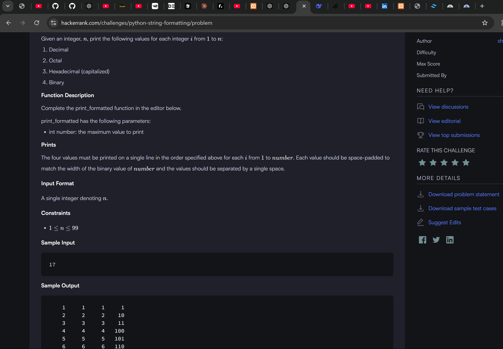
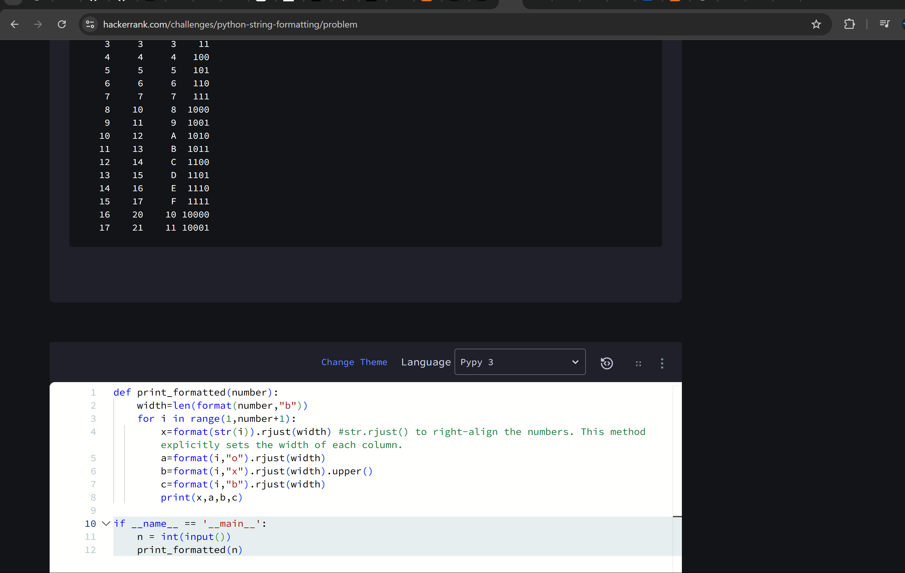

```
def print_formatted(number):
    width=len(format(number,"b"))
    for i in range(1,number+1):
        x=format(str(i)).rjust(width) #str.rjust() to right-align the numbers. This method explicitly sets the width of each column.
        a=format(i,"o").rjust(width)
        b=format(i,"x").rjust(width).upper()
        c=format(i,"b").rjust(width)
        print(x,a,b,c)

if __name__ == '__main__':
    n = int(input())
    print_formatted(n)
    
    ```