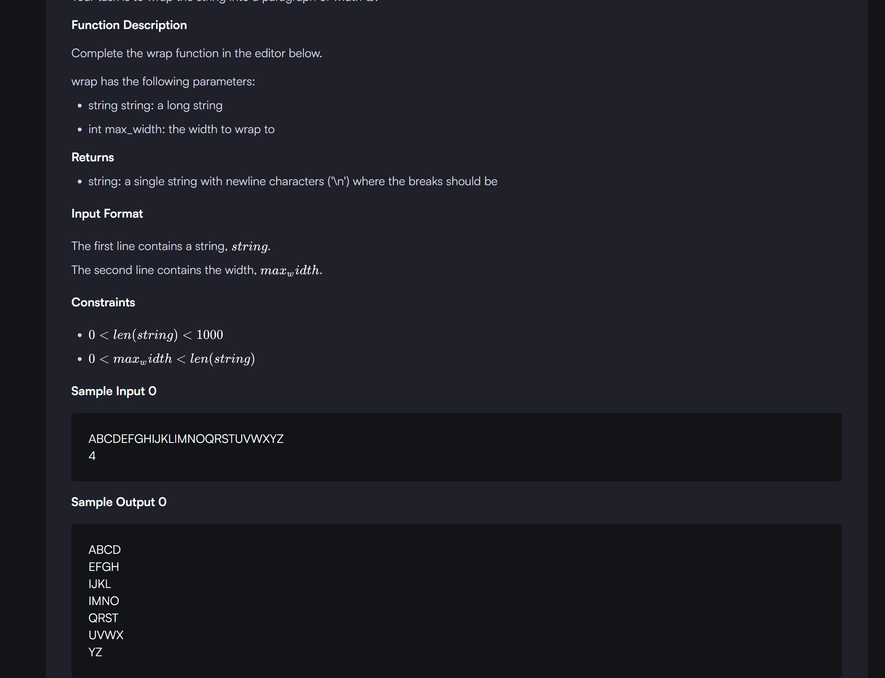

```
import textwrap
def wrap(string, max_width):
    result=[]
    for i in range(0,len(string),max_width):
        result.append(string[i:max_width+i])
    return "\n".join(result)  # this line is joining all the element in the string with a new line character (why i had done this , to not print "None")
          
     
  
if __name__ == '__main__':
    string, max_width = input(), int(input())
    result = wrap(string, max_width)
    print(result)

```