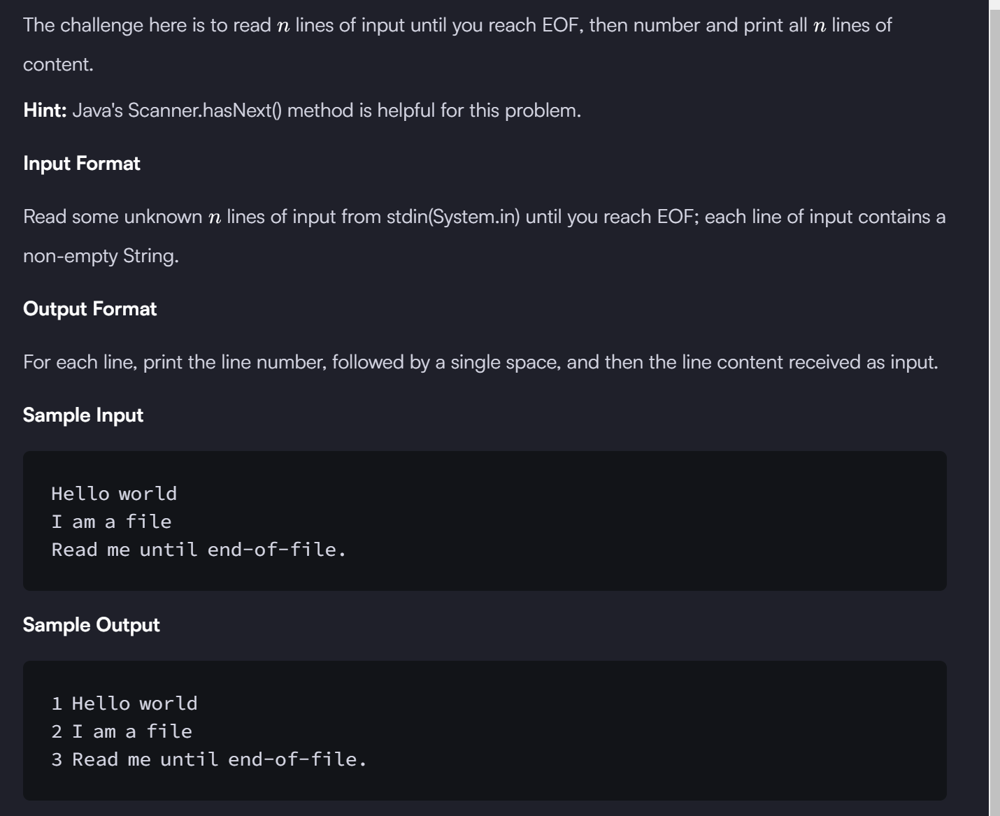

```

import java.io.*;
import java.util.*;

public class Solution {

    public static void main(String[] args) {
        
        
    Scanner sc=new Scanner(System.in);
    int i=1;
    while(sc.hasNext()){    // this .hasNext() function helps you to check whether there is another  token input() available or not ?? if yes then it will give true value else false and loop will end
        String a=sc.nextLine();
        System.out.println(i+" "+a);
        i++;
    }
    
    
    
    }
}

```