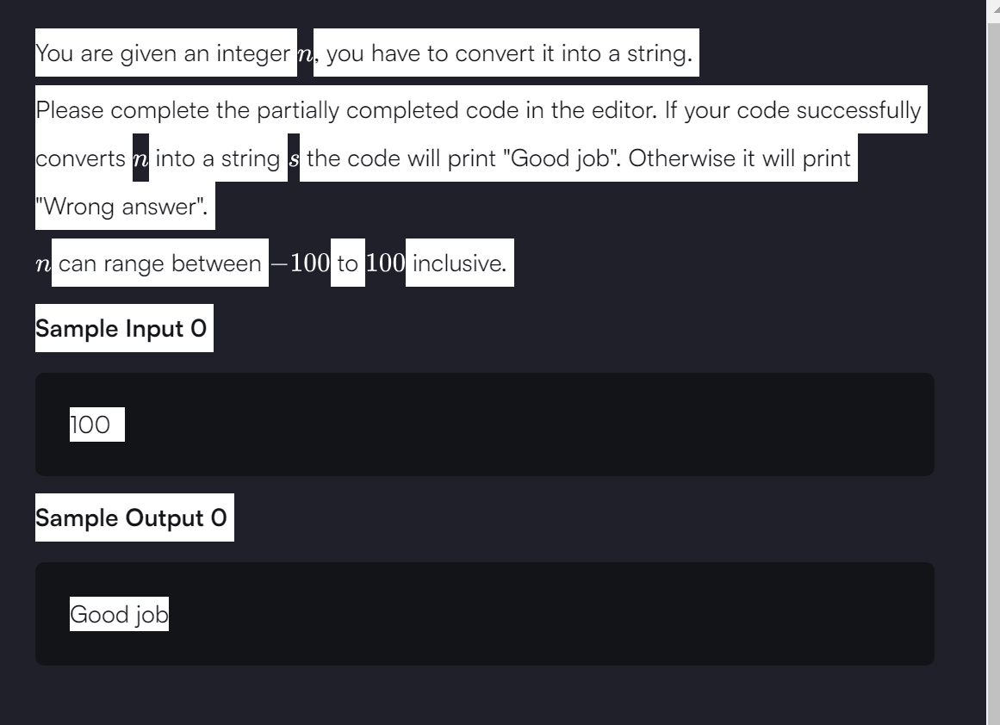

```

// a best use of try and catch in this problem
import java.io.*;
import java.util.*;


public class Solution {

    public static void main(String[] args) {
        /* Enter your code here. Read input from STDIN. Print output to STDOUT. Your class should be named Solution. */
        
        Scanner sc=new Scanner(System.in);
        
        int num=sc.nextInt();
        
        String s=String.valueOf(num); // we are converting integer to string
        
        // Alternative method: Using Integer.toString()
        // String s = Integer.toString(n);
        
        if(num>=-100 && num <= 100){
            try{
                System.out.println("Good job");
            }catch(Exception e){
                System.out.println("Wrong answer");
            }
        }
        
        
    }
}


```