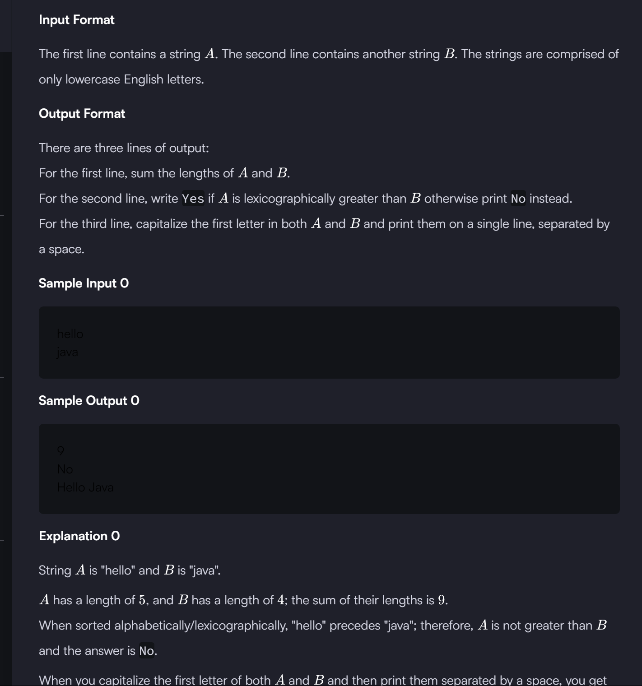

```

import java.io.*;
import java.util.*;

public class Solution {

    public static void main(String[] args) {
        /* Enter your code here. Read input from STDIN. Print output to STDOUT. Your class should be named Solution. */
        
        Scanner u=new Scanner(System.in);
        
        String a=u.nextLine();
        String b=u.nextLine();
        int c=a.length() + b.length();
        System.out.println(c);
        
       char d=a.charAt(0);  // or we can use compareTo function and it will be the good way.
        int ascii=(int)d;
        
        char e=b.charAt(0);
        int ascii1=(int)e;
        
        if(ascii>ascii1){ 
            System.out.println("Yes");
        }
        else{
            System.out.println("No");
        }
        
        String newa=a.substring(0,1).toUpperCase();
        String newb=b.substring(0,1).toUpperCase();
        
        
        System.out.println(newa+a.substring(1,a.length())+" "+newb+b.substring(1,b.length()));
        
    }
}

```