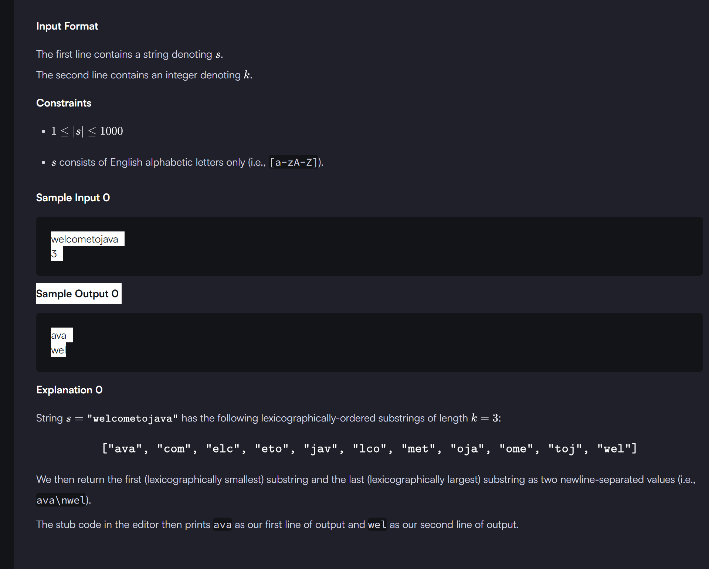

```
<!--  compareTo() in Java – Summary
The compareTo() method compares two values lexicographically and returns:

Negative (< 0) → If the first value is smaller
Zero (0) → If both values are equal
Positive (> 0) → If the first value is greater -->


import java.util.Scanner;

public class Solution {
    public static String getSmallestAndLargest(String s, int k) {
        String smallest = s.substring(0,k);
        String largest = s.substring(0,k);

        
        for(int i=0;i<=s.length()-k;i++){
            String substring1=s.substring(i,i+k);
            if(substring1.compareTo(smallest)<0){
                smallest=substring1;
            }
            if(substring1.compareTo(largest)>0){
                largest=substring1;
            }
            
        }
        
        return smallest + "\n" + largest;
    }


    public static void main(String[] args) {
        Scanner scan = new Scanner(System.in);
        String s = scan.next();
        int k = scan.nextInt();
        scan.close();
      
        System.out.println(getSmallestAndLargest(s, k));
    }
}

```