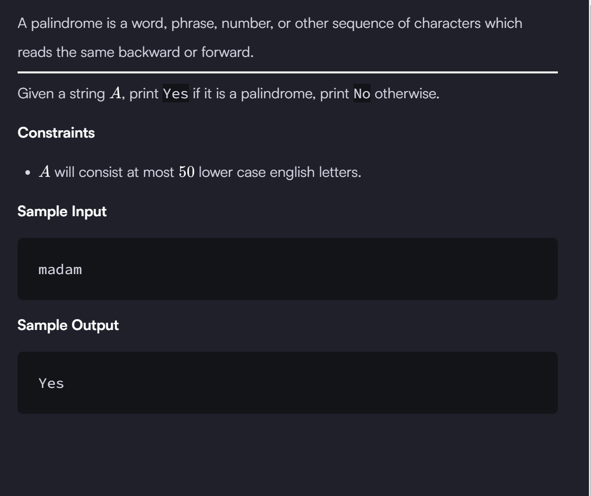

```

import java.io.*;
import java.util.*;

public class Solution {

    public static void main(String[] args) {
        
        Scanner sc=new Scanner(System.in);
        String A=sc.next();
        /* Enter your code here. Print output to STDOUT. */
        char arr[]=A.toCharArray();
        
        
        int num=arr.length-1;
        int flag=1;              // using flag is a good approach...

        for(int i=0;i<(arr.length)/2;i++){    // check the loop carefully , we will traveres half of the array no need to traverse at the end
            if(arr[i] != arr[num-i]){
                flag=0;
            }
        }
        System.out.println((flag==1)?"Yes":"No");  // use ternary operator instead of if-else statement !!!!!! good practice
    }
}

        
           


```