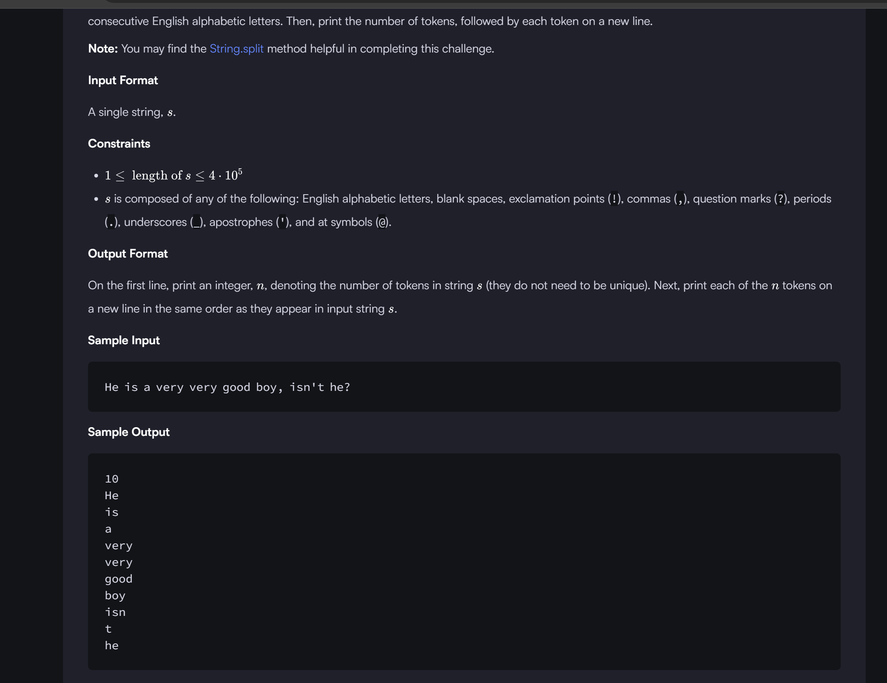

```

// [^a-zA-Z]+ (Regular Expression Explanation)
// [^a-zA-Z] → This means "any character that is NOT a letter (a-z or A-Z)".
// ^ inside [] means negation, so [^a-zA-Z] matches any non-alphabetic character (such as spaces, punctuation, numbers, etc.).
// + → This means "one or more occurrences" of the preceding pattern.
// So, [^a-zA-Z]+ matches one or more consecutive non-alphabetic characters.

import java.io.*;
import java.util.*;

public class Solution {

    public static void main(String[] args) {
        Scanner scan = new Scanner(System.in);
        String s = scan.nextLine().trim();
        // Write your code here.
        String arr[]=s.split("[^a-zA-Z]+");
        
         if(s.isEmpty()){
            System.out.println(0);
         }
         else{
        System.out.println(arr.length);
        for(String x:arr){
            System.out.println(x);
        }
         }
        scan.close();
            
    }
}

```