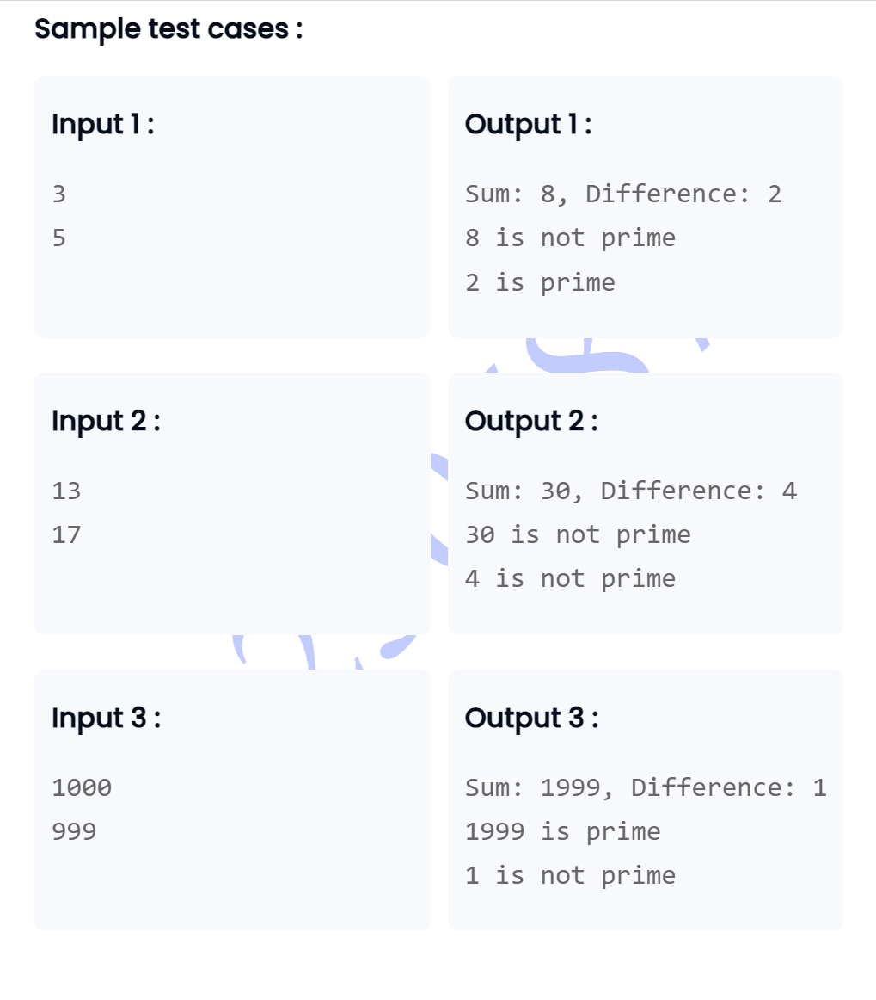

```
// A good learning of method overloading, arrays, classes and object

import java.util.Scanner;
class Calculator {
    
        int sum=0;
    public int sum( int [] arr){
        for(int i=0;i<arr.length;i++){
           sum+=arr[i]; 
        }
        return sum;
    }
    double doublesum=0;
    public double sum(double []arr){
        for(int i=0;i<arr.length;i++){
            doublesum+=arr[i];
        }
        return doublesum;
    }
    
}
class Main {
    public static void main(String[] args) {
        Scanner scanner = new Scanner(System.in);
        Calculator calculator = new Calculator();

        String intInput = scanner.nextLine();
        String[] intStrings = intInput.split(" ");   // here we are putting the inputs in a array of strings.
        int[] intArray = new int[intStrings.length];
        for (int i = 0; i < intStrings.length; i++) {
            intArray[i] = Integer.parseInt(intStrings[i]);  ////This converts ["1", "2", "3", "4", "5"] into an int[] array
        }
        
        int intSum = calculator.sum(intArray);

        String doubleInput = scanner.nextLine();
        String[] doubleStrings = doubleInput.split(" ");
        double[] doubleArray = new double[doubleStrings.length];
        for (int i = 0; i < doubleStrings.length; i++) {
            doubleArray[i] = Double.parseDouble(doubleStrings[i]);   //This converts ["1","2","3","4","5"] into an double[] array
        }
        double doubleSum = calculator.sum(doubleArray);
        
        System.out.println("Sum of integers: " + intSum);
        System.out.println("Sum of doubles: " + doubleSum);
    }
}


```