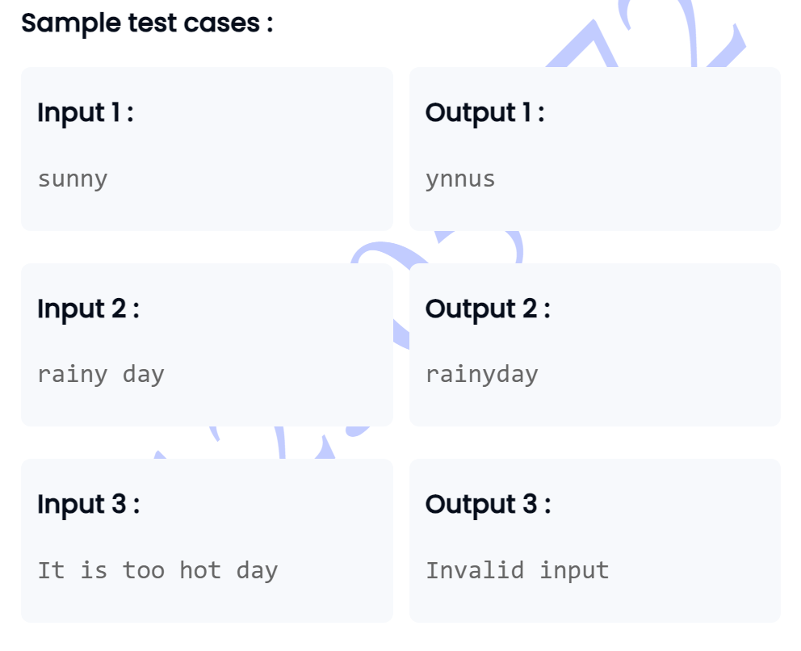

```

import java.util.Scanner;

public class Main {

public static void main(String[] args) {
    
    Scanner kash=new Scanner(System.in);
    
    int num=kash.nextInt();
    int arr[]=new int[num];
    
    
    for(int i=0;i<arr.length;i++){
        arr[i]=kash.nextInt();
    }
    
    for(int i=0;i<arr.length;i++){
        int sum=0;
        for(int j=i+1;j<arr.length;j++){
            sum+=arr[j];
        }
           if(arr[i]>sum){
               System.out.print(arr[i]+" ");
           }
            
        
    }
    
}
}

```


```

import java.util.Scanner;
// You are using Java
class ExpenseAnalyzer {
    
    public int calculateMaxRemainingBudget(int expenses []){
        int small=expenses[0];
        int sum=0;
         for (int i = 0; i < expenses.length; i++) {
            if(expenses[i] <small){
                small=expenses[i];
            }
            sum+=expenses[i];
         }
        
        int absSmall=Math.abs(small);
       
        return absSmall+sum;
        
     }
}

class MaxSumAfterDeletion {

    public static void main(String[] args) {
        Scanner scanner = new Scanner(System.in);

        int n = scanner.nextInt();

        int[] expenses = new int[n];
        for (int i = 0; i < n; i++) {
            expenses[i] = scanner.nextInt();
        }

        ExpenseAnalyzer analyzer = new ExpenseAnalyzer();
        int maxRemainingBudget = analyzer.calculateMaxRemainingBudget(expenses);

        System.out.println(maxRemainingBudget);

        scanner.close();
    }
}

```


```
// remove duplicates from the String

import java.util.Scanner;

class RemoveDuplicatesUtility {
    public static String removeDuplicates(String input) {
        if (input == null || input.isEmpty()) {
            return input;
        }
        
        StringBuilder result = new StringBuilder();
        
        for (int i = 0; i < input.length(); i++) {
            char currentChar = input.charAt(i);
            
            // Check if the character is already in our result
            int index = result.indexOf(String.valueOf(currentChar));
            
            // If we haven't seen this character before, add it
            if (index == -1) {
                result.append(currentChar);
            }
        }
        
        return result.toString();
    }
}

class Main {
    public static void main(String[] args) {
        Scanner scanner = new Scanner(System.in);

        String userInput = scanner.nextLine();
        String result = RemoveDuplicatesUtility.removeDuplicates(userInput);
        System.out.println(result);

        scanner.close();
    }
}

```


```
import java.util.Scanner;

public class StringManipulation {
    public static String concatenateUnique(String firstString, String secondString) {
        StringBuilder result = new StringBuilder();
        
        // Process the first string
        for (int i = 0; i < firstString.length(); i++) {
            char currentChar = firstString.charAt(i);
            if (result.indexOf(String.valueOf(currentChar)) == -1) {
                result.append(currentChar);
            }
        }
        
        // Process the second string
        for (int i = 0; i < secondString.length(); i++) {
            char currentChar = secondString.charAt(i);
            if (result.indexOf(String.valueOf(currentChar)) == -1) {
                result.append(currentChar);
            }
        }
        
        return result.toString();
    }
}

class Main {
    public static void main(String[] args) {
        Scanner scanner = new Scanner(System.in);

        String firstString = scanner.nextLine();
        String secondString = scanner.nextLine();
        String concatenatedString = StringManipulation.concatenateUnique(firstString, secondString);
        System.out.println(concatenatedString);

        scanner.close();
    }
}

```




```

import java.util.Scanner;

class StringOps {
    // Method to reverse a single string
    public String manipulate(String[] input) {
        if (input.length == 1) {
            return reverse(input[0]);
        } else if (input.length == 2) {
            return concatenate(input[0], input[1]);
        } else {
            return "Invalid input";
        }
    }
    
    // Helper method to reverse a string
    private String reverse(String str) {
        StringBuilder reversed = new StringBuilder(str);
        return reversed.reverse().toString();
    }
    
    // Helper method to concatenate two strings
    private String concatenate(String str1, String str2) {
        return str1 + str2;
    }
}

class Main {
    public static void main(String[] args) {
        StringOps seetha = new StringOps();
        Scanner scanner = new Scanner(System.in);
        String input = scanner.nextLine().trim();
        String[] input_data = input.split(" ");
        String result = seetha.manipulate(input_data);
        System.out.println(result);
    }
}

```


```
import java.util.Scanner;

class EncoderDecoder {
    // Method to encode an array of strings into a single string
    public String encode(String[] messages) {
        if (messages == null || messages.length == 0) {
            return "";
        }
        
        StringBuilder encoded = new StringBuilder();
        
        // Append the first message without a delimiter before it
        encoded.append(messages[0]);
        
        // Append the remaining messages with a delimiter before each
        for (int i = 1; i < messages.length; i++) {
            encoded.append("#").append(messages[i]);
        }
        
        return encoded.toString();
    }
    
    // Method to decode a single string into an array of strings
    public String[] decode(String encoded) {
        if (encoded == null || encoded.isEmpty()) {
            return new String[0];
        }
        
        // Split the encoded string by the delimiter
        return encoded.split("#");
    }
}

class Main {
    public static void main(String[] args) {
        EncoderDecoder encoderDecoder = new EncoderDecoder();
        Scanner scanner = new Scanner(System.in);
        String userInput = scanner.nextLine();
        String[] messages = userInput.split(" ");
        String encoded = encoderDecoder.encode(messages);
        System.out.println("Encoded: " + encoded);
        String[] decoded = encoderDecoder.decode(encoded);
        System.out.println("Decoded: ");
        for (String message : decoded) {
            System.out.println(message);
        }

        scanner.close();
    }
}

```


```

import java.util.Scanner;
import java.util.Arrays;

public class Main {
    public static void main(String[] args) {
        // Create a scanner to read input
        Scanner scanner = new Scanner(System.in);
        
        // Read the input string
        String inputString = scanner.nextLine();
        
        // Convert the string to a character array
        char[] charArray = inputString.toCharArray();
        
        // Build a formatted string representation of the character array
        StringBuilder result = new StringBuilder();
        result.append("[");
        
        for (int i = 0; i < charArray.length; i++) {
            result.append(charArray[i]);
            
            // Add comma and space if not the last element
            if (i < charArray.length - 1) {
                result.append(", ");
            }
        }
        
        result.append("]");
        
        // Print the formatted character array
        System.out.println(result.toString());
        
        // Close the scanner
        scanner.close();
    }
}

```
