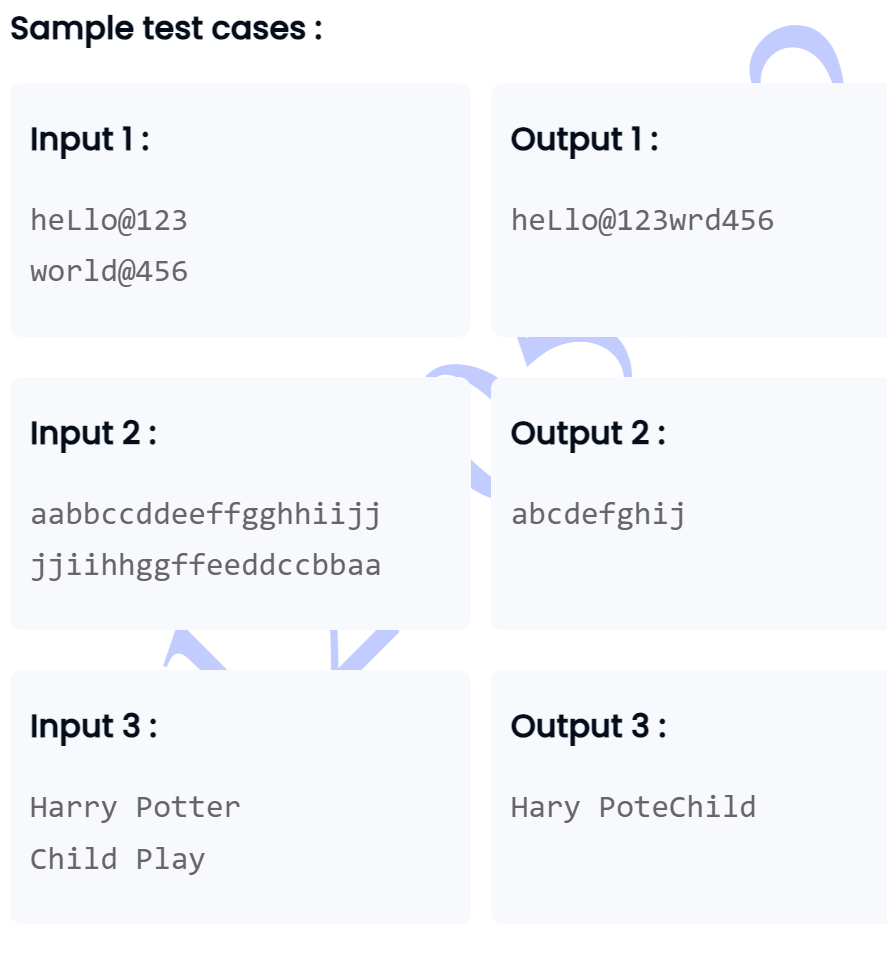

```
import java.util.Scanner;

public class StringManipulation {
    public static String concatenateUnique(String firstString, String secondString) {
        StringBuilder result = new StringBuilder();
        
        // Process the first string
        for (int i = 0; i < firstString.length(); i++) {
            char currentChar = firstString.charAt(i);
            if (result.indexOf(String.valueOf(currentChar)) == -1) {
                result.append(currentChar);
            }
        }
        
        // Process the second string
        for (int i = 0; i < secondString.length(); i++) {
            char currentChar = secondString.charAt(i);
            if (result.indexOf(String.valueOf(currentChar)) == -1) {
                result.append(currentChar);
            }
        }
        
        return result.toString();
    }
}

class Main {
    public static void main(String[] args) {
        Scanner scanner = new Scanner(System.in);

        String firstString = scanner.nextLine();
        String secondString = scanner.nextLine();
        String concatenatedString = StringManipulation.concatenateUnique(firstString, secondString);
        System.out.println(concatenatedString);

        scanner.close();
    }
}

```