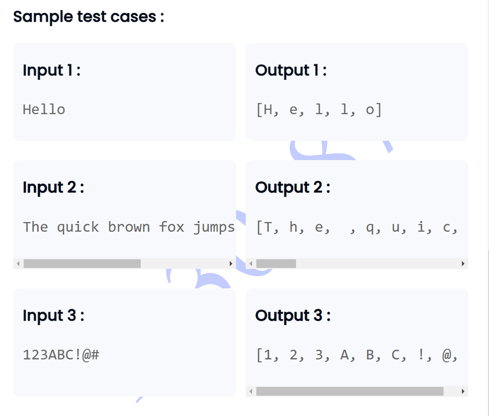

```

import java.util.Scanner;
import java.util.Arrays;

public class Main {
    public static void main(String[] args) {
        Scanner scanner = new Scanner(System.in);
        String input = scanner.nextLine();
        
        
        char[] charArray = input.toCharArray();  // Converts the string intto a character array
        
    
        System.out.println(Arrays.toString(charArray)); // here first toString is converting the array in the string and print as it is.
        
        
    }
}


```
