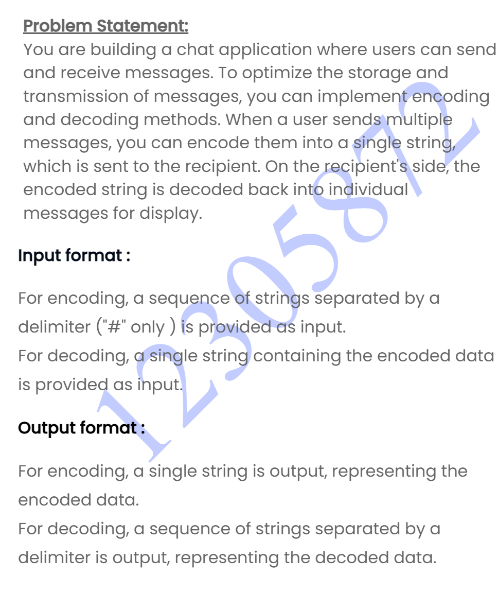
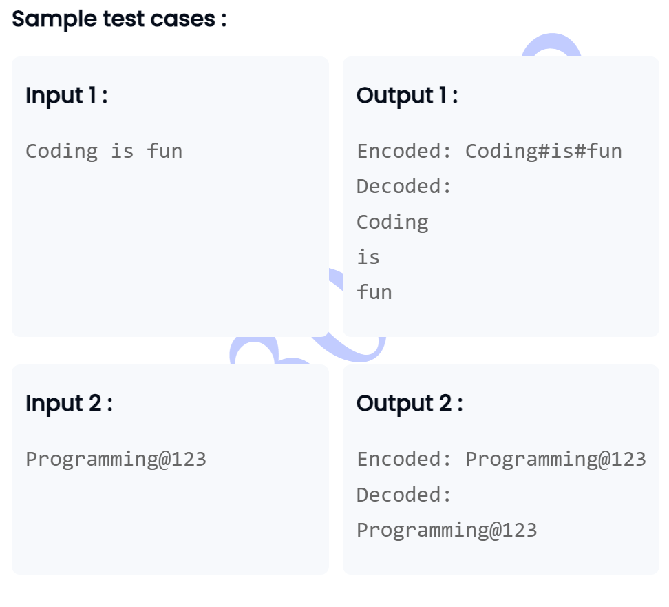

```
import java.util.Scanner;

class EncoderDecoder {
    // Method to encode an array of strings into a single string
    public String encode(String[] messages) {
        if (messages == null || messages.length == 0) {
            return "";
        }
        
        StringBuilder encoded = new StringBuilder();
        
        // Append the first message without a delimiter before it
        encoded.append(messages[0]);
        
        // Append the remaining messages with a delimiter before each
        for (int i = 1; i < messages.length; i++) {
            encoded.append("#").append(messages[i]);
        }
        
        return encoded.toString();
    }
    
    // Method to decode a single string into an array of strings
    public String[] decode(String encoded) {
        if (encoded == null || encoded.isEmpty()) {
            return new String[0];
        }
        
        // Split the encoded string by the delimiter
        return encoded.split("#");
    }
}

class Main {
    public static void main(String[] args) {
        EncoderDecoder encoderDecoder = new EncoderDecoder();
        Scanner scanner = new Scanner(System.in);
        String userInput = scanner.nextLine();
        String[] messages = userInput.split(" ");
        String encoded = encoderDecoder.encode(messages);
        System.out.println("Encoded: " + encoded);
        String[] decoded = encoderDecoder.decode(encoded);
        System.out.println("Decoded: ");
        for (String message : decoded) {
            System.out.println(message);
        }

        scanner.close();
    }
}

```