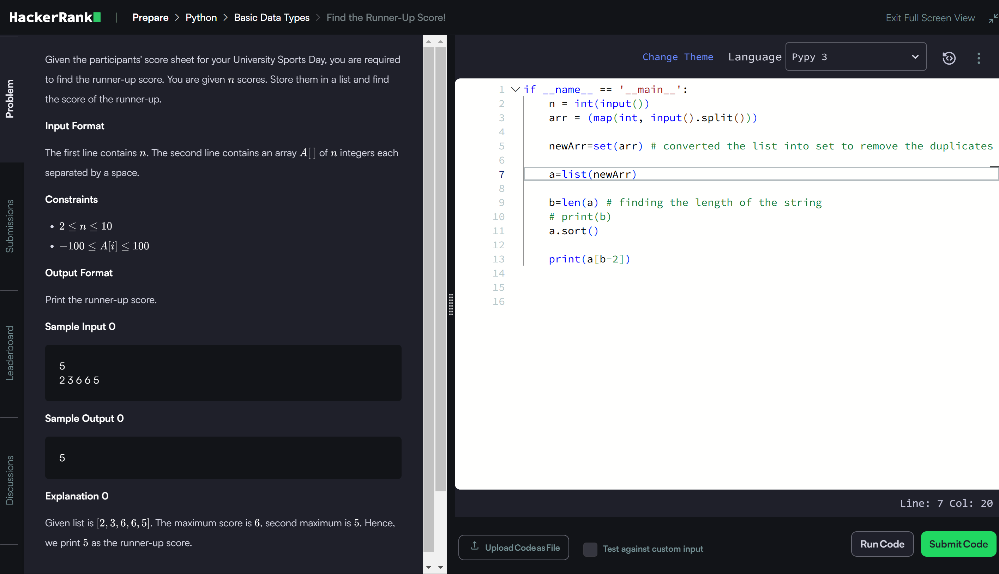

```if __name__ == '__main__':
    n = int(input())
    arr = (map(int, input().split()))
    
    newArr=set(arr) # converted the list into set to remove the duplicates
    
    a=list(newArr) 
    
    b=len(a) # finding the length of the string
    # print(b)
    a.sort()
    
    print(a[b-2])
    
    ```