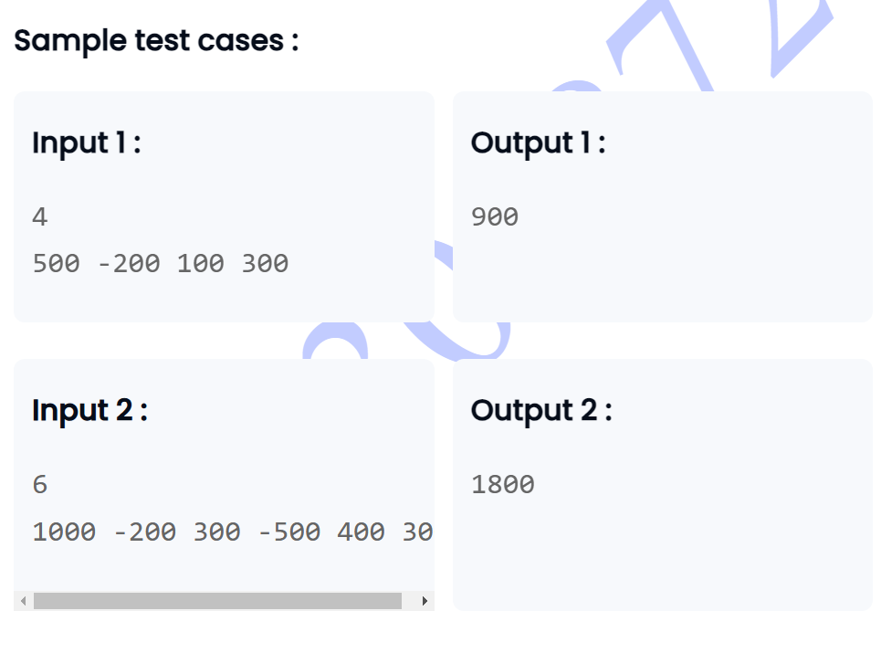

```

import java.util.Scanner;
// You are using Java
class ExpenseAnalyzer {
    
    public int calculateMaxRemainingBudget(int expenses []){
        int small=expenses[0];
        int sum=0;
         for (int i = 0; i < expenses.length; i++) {
            if(expenses[i] <small){
                small=expenses[i];
            }
            sum+=expenses[i];
         }
        
        int absSmall=Math.abs(small);
       
        return absSmall+sum;
        
     }
}

class MaxSumAfterDeletion {

    public static void main(String[] args) {
        Scanner scanner = new Scanner(System.in);

        int n = scanner.nextInt();

        int[] expenses = new int[n];
        for (int i = 0; i < n; i++) {
            expenses[i] = scanner.nextInt();
        }

        ExpenseAnalyzer analyzer = new ExpenseAnalyzer();
        int maxRemainingBudget = analyzer.calculateMaxRemainingBudget(expenses);

        System.out.println(maxRemainingBudget);

        scanner.close();
    }
}

```