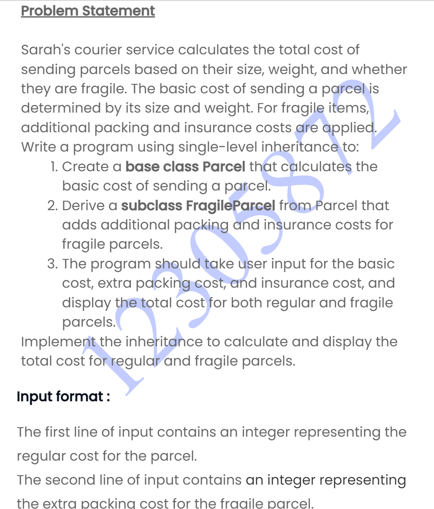
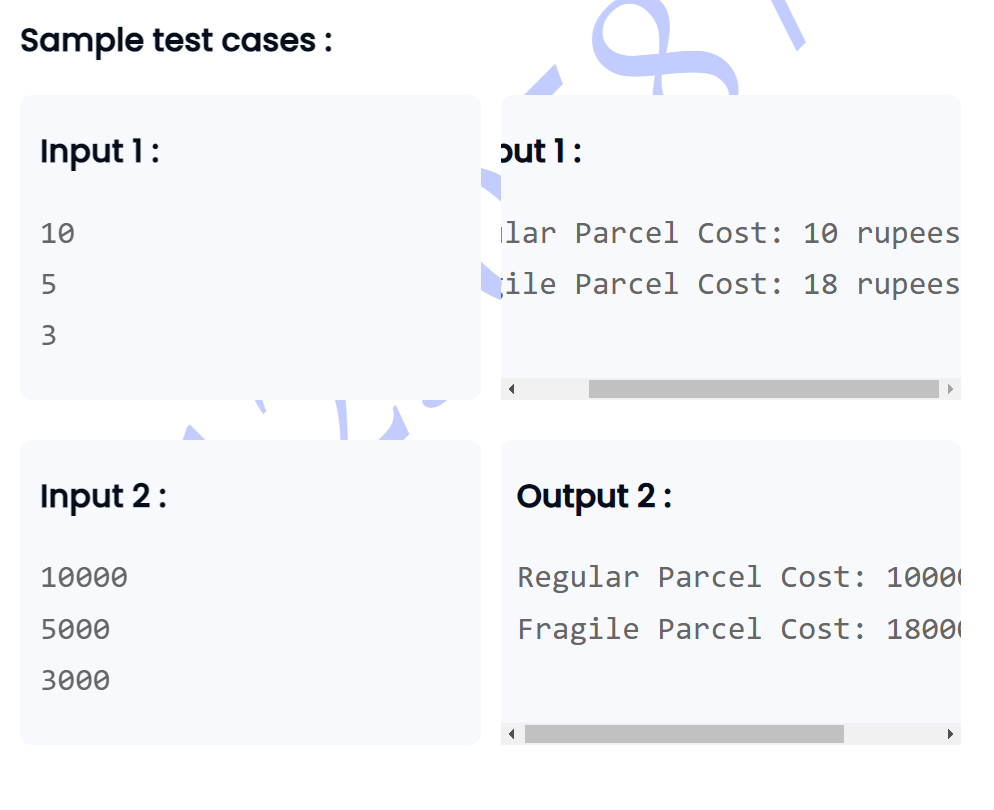

```

import java.util.Scanner;

// Base class representing a regular parcel
class Parcel {
    protected int basicCost;

    // Constructor
    public Parcel(int basicCost) {
        this.basicCost = basicCost;
    }

    // Method to calculate the cost of a regular parcel
    public int calculateCost() {
        return basicCost;
    }
}

// Subclass representing a fragile parcel
class FragileParcel extends Parcel {
    private int extraPackingCost;
    private int insuranceCost;

    // Constructor
    public FragileParcel(int basicCost, int extraPackingCost, int insuranceCost) {
        super(basicCost); // Calls the constructor of the parent class (Parcel) to initialize basicCost
        this.extraPackingCost = extraPackingCost;
        this.insuranceCost = insuranceCost;
    }

    // Method to calculate the total cost of a fragile parcel
    @Override
    public int calculateCost() {
        return basicCost + extraPackingCost + insuranceCost;
    }
}

public class Main {
    public static void main(String[] args) {
        Scanner scanner = new Scanner(System.in);
        
        // Reading input values
        int basicCost = scanner.nextInt();
        int extraPackingCost = scanner.nextInt();
        int insuranceCost = scanner.nextInt();
        
        // Creating instances of Parcel and FragileParcel
        Parcel regularParcel = new Parcel(basicCost);
        FragileParcel fragileParcel = new FragileParcel(basicCost, extraPackingCost, insuranceCost);
        
        // Displaying the results
        System.out.println("Regular Parcel Cost: " + regularParcel.calculateCost() + " rupees");
        System.out.println("Fragile Parcel Cost: " + fragileParcel.calculateCost() + " rupees");
        
        scanner.close();
    }
}
```