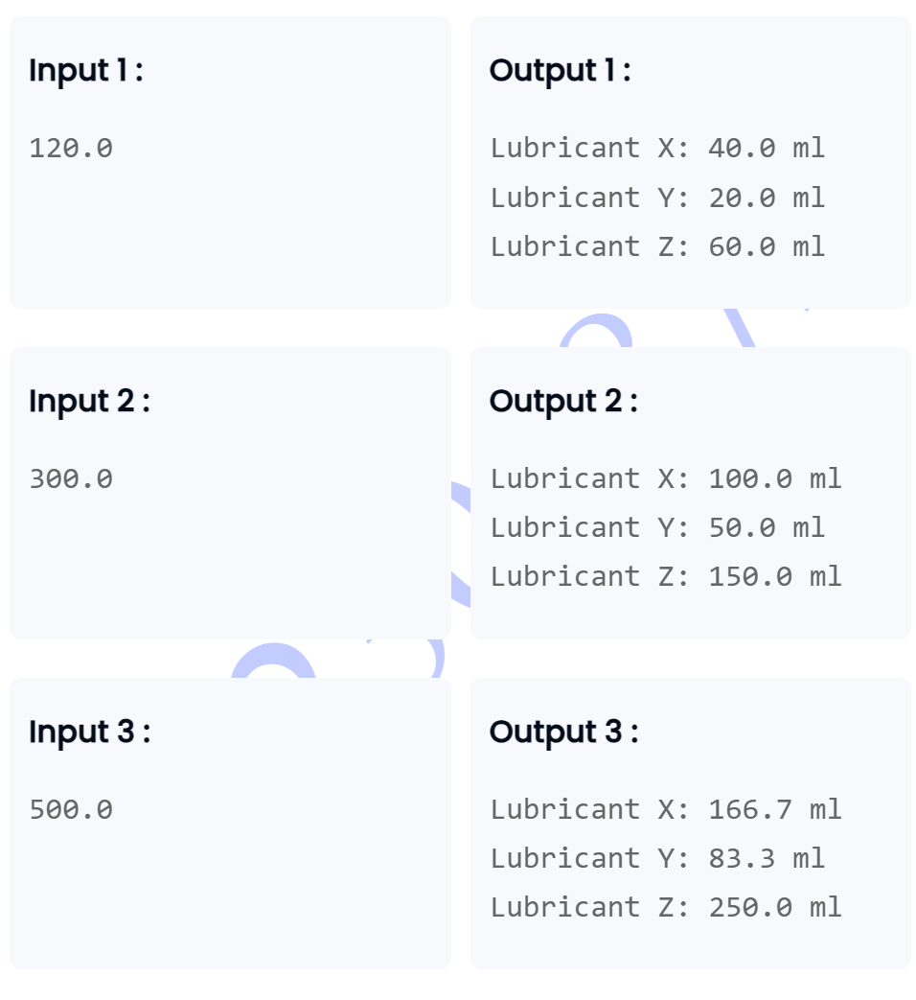

```
// very easy question ....
import java.util.*;

class Main{
    public static void main(String[] args){
        
        Scanner sc = new Scanner(System.in);
        double num= sc.nextDouble();
        
        double x=num/3;
        double y=x/2;
        double z=num/2;
        
        System.out.printf("Lubricant X: %.1f ml",x);
        System.out.printf("Lubricant Y: %.1f ml",y);
        System.out.printf("Lubricant Z: %.1f ml",z);
        
    }
}

```