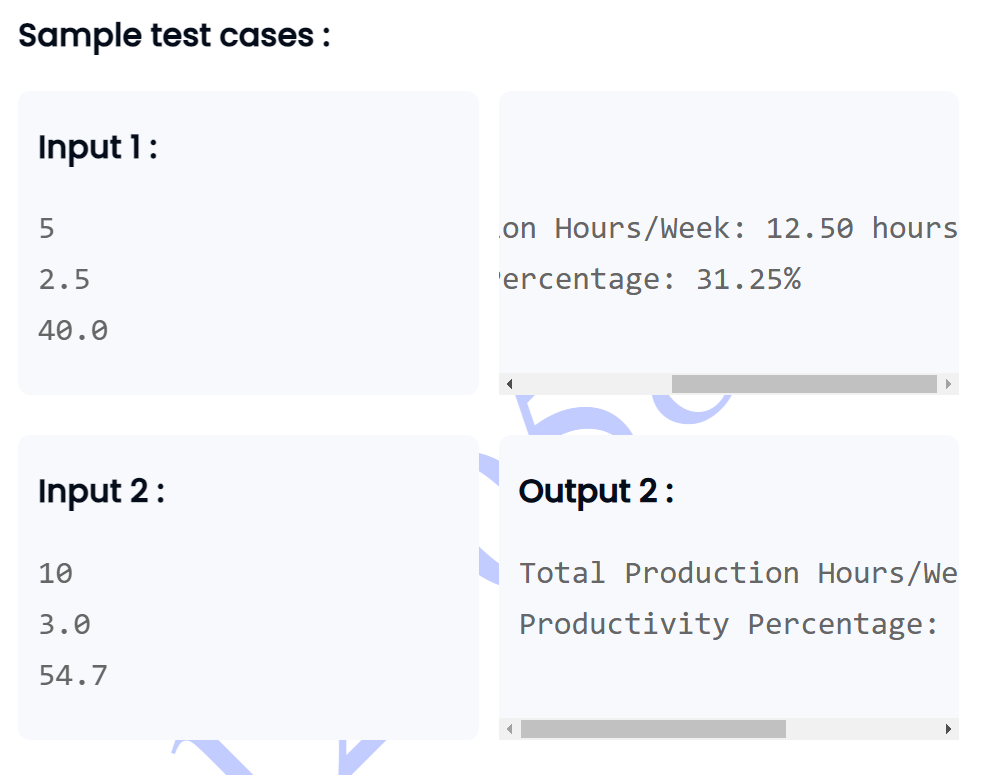

```
// If you have to print % symbol in the printf statement, you have to use it 2 times to print once


import java.util.*;

class Main{
    
    public static void main(String args[]){
        Scanner sc= new Scanner(System.in);
        
        int num=sc.nextInt();
        double num1=sc.nextDouble();
        double num2=sc.nextDouble();
        
        double hour=num*num1;
        double percent=(hour/num2)*100;
        
        System.out.printf("Total Production Hours/Week: %.2f hours",hour);
        System.out.println();
        System.out.printf("Productivity Percentage: %.2f%%",percent);
        
        
        
    }
    
    
    
}
```