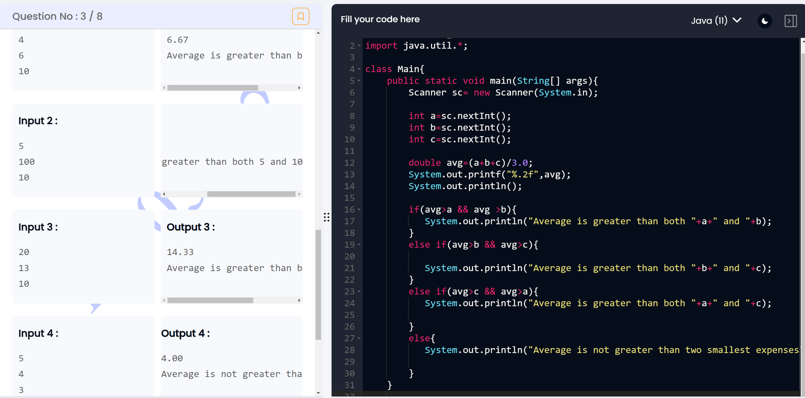

```

import java.util.*;

class Main{
    public static void main(String[] args){
        Scanner sc= new Scanner(System.in);
        
        int a=sc.nextInt();
        int b=sc.nextInt();
        int c=sc.nextInt();
        
        double avg=(a+b+c)/3.0;  // divide by 3.0 to get the digits after decimal
        System.out.printf("%.2f",avg);
        System.out.println();
        
        if(avg>a && avg >b){
           System.out.println("Average is greater than both "+a+" and "+b);
        }
        else if(avg>b && avg>c){
            
           System.out.println("Average is greater than both "+b+" and "+c);
        }
        else if(avg>c && avg>a){
           System.out.println("Average is greater than both "+a+" and "+c);
            
        }
        else{
           System.out.println("Average is not greater than two smallest expenses");
            
        }
    }
       
}
```