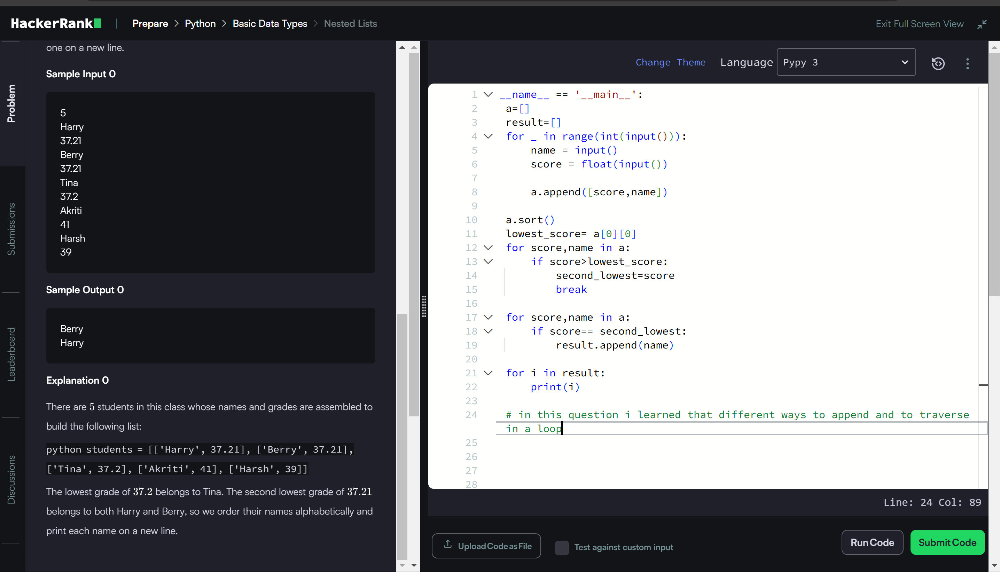

```if __name__ == '__main__':
    a=[]
    result=[]
    for _ in range(int(input())):
        name = input()
        score = float(input())  
        
        a.append([score,name])
        
    a.sort()
    lowest_score= a[0][0]
    for score,name in a:
        if score>lowest_score:
            second_lowest=score
            break
    
    for score,name in a:
        if score== second_lowest:
            result.append(name)
            
    for i in result:
        print(i) 
    
    # in this question i learned that different ways to append and to traverse in a loop
    ```