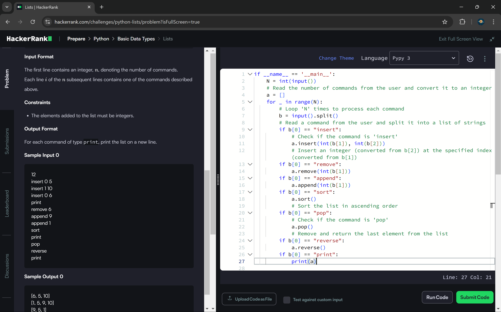

```
if __name__ == '__main__':
    N = int(input())
    # Read the number of commands from the user and convert it to an integer
    a = []
    for _ in range(N):
        # Loop 'N' times to process each command
        b = input().split()
        # Read a command from the user and split it into a list of strings
        if b[0] == "insert":
            # Check if the command is 'insert'
            a.insert(int(b[1]), int(b[2]))
            # Insert an integer (converted from b[2]) at the specified index (converted from b[1])
        if b[0] == "remove":
            a.remove(int(b[1]))
        if b[0] == "append":
            a.append(int(b[1]))
        if b[0] == "sort":
            a.sort()
            # Sort the list in ascending order
        if b[0] == "pop":
            # Check if the command is 'pop'
            a.pop()
            # Remove and return the last element from the list
        if b[0] == "reverse":
            a.reverse()
        if b[0] == "print":
            print(a)
```

            
        
        
        
        
        
        
        
                
 
        
        
